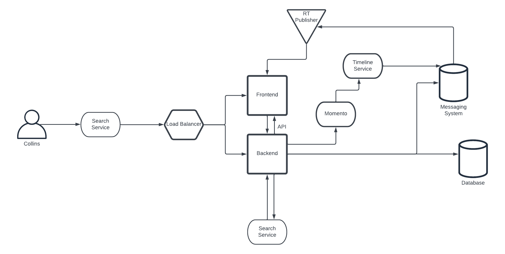
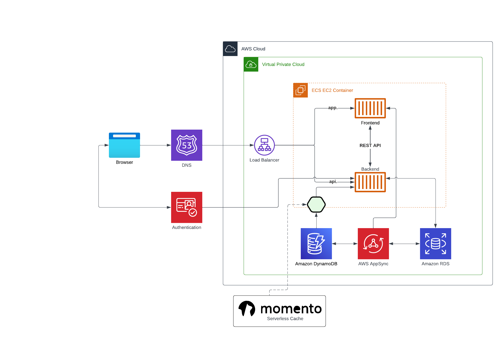
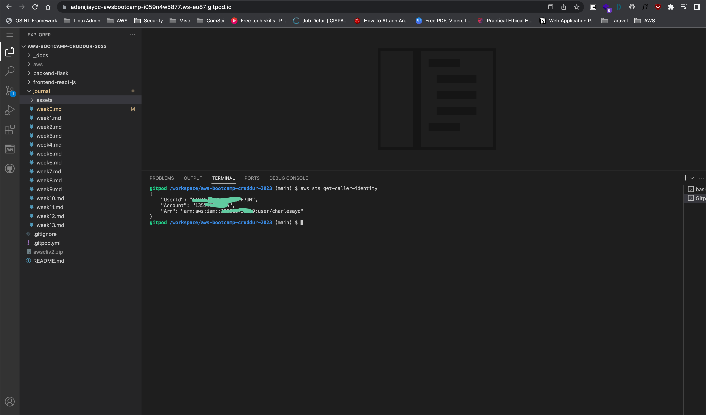
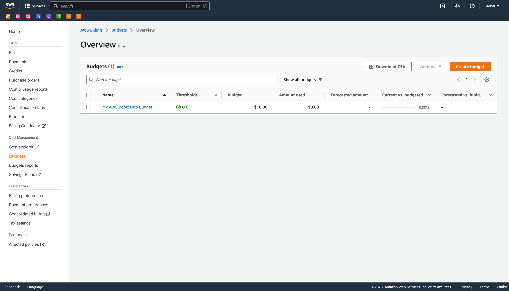

# Week 0 — Billing and Architecture

## REQUIRED WORK

### Pre-requisites for this week

- Recreated Conceptual Diagram in Lucid Charts

[Link to Lucid Chart](https://lucid.app/lucidchart/f6ff3234-50b6-4784-83f0-25608d62bd88/edit?viewport_loc=-624%2C-95%2C2714%2C1542%2Ce-eyg~~ZNQ5a&invitationId=inv_358226f5-de8c-4f49-a7d7-8356958371af)

- Recreated Architectural Diagram in Lucid Charts

[Link to Lucid Chart](https://lucid.app/lucidchart/f6ff3234-50b6-4784-83f0-25608d62bd88/edit?viewport_loc=-265%2C-2%2C3088%2C1754%2C0_0&invitationId=inv_358226f5-de8c-4f49-a7d7-8356958371af)

- Installed AWS CLI on GitPod

- Created a budget on the AWS Console

- Created a billing alert on the AWS Console

